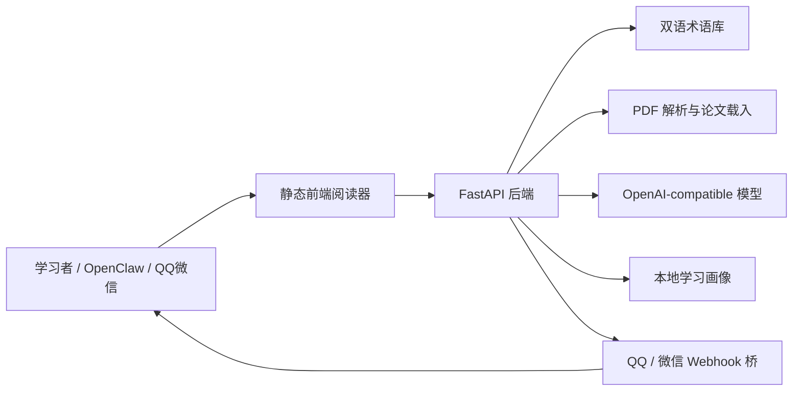

# AI-From-Zero 参赛说明

AI-From-Zero 的参赛定位是“AI 学习驾驶舱”：把论文阅读、术语理解、下一篇论文推荐、AI 伴学和 QQ/微信消息桥接连成一个可运行的学习工具。

## 评分标准对应

| 评分维度 | 项目对应能力 |
| --- | --- |
| 部署与连接完整性 | 本地一键启动、`.env` 模型配置、OpenClaw 工具、微信/QQ Webhook 桥接、本地模拟验收 |
| 技能/项目完成度 | 文本/PDF 分析、术语高亮、双语术语库、论文载入、学习路径、下一篇论文推荐、AI 伴学 |
| 技术探索与真实性 | PDF 全文抽取、论文元数据搜索、本地降级、OpenAI-compatible 配置、CI、自检脚本、消息桥接 |
| 创新性 | 面向初学者的论文溯源学习闭环，而不是单纯聊天或 PDF 摘要 |
| 展示表达 | 三个固定案例、评分说明、架构图、快速体验路径 |

## 快速体验路径

1. `git clone https://github.com/Peixuan-Li0402/AI-From-Zero.git`
2. Windows 运行 `.\start_windows.ps1`，macOS/Linux 运行 `./start.sh`。
3. 打开 `http://127.0.0.1:8080`。
4. 点击首页“竞赛演示案例”中的任意案例。
5. 等待系统载入论文、生成术语高亮、下一篇推荐和 AI 伴学上下文。
6. 运行消息模拟：`python tools/openclaw_ai_from_zero.py message "解释 Transformer"`。

## 三个演示案例

- Transformer 经典论文：展示术语高亮、概念链条、下一篇 BERT/RAG 等推荐。
- RAG / Agent 热点路线：展示检索增强生成到工具调用和 Agent 的学习路径。
- 系统工程方向：通过 FlashAttention 展示 AI 系统优化和论文证据片段。

## 架构图



## 验收命令

```bash
python -m pytest
python tools/check_release_readiness.py --strict
python tools/check_api_smoke.py --base-url http://127.0.0.1:8080
```

服务启动后还可以检查：

```bash
curl http://127.0.0.1:8080/api/health
curl http://127.0.0.1:8080/api/integrations/status
curl http://127.0.0.1:8080/api/demo-cases
```

## QQ / 微信连接说明

项目不提交真实密钥。连接方式是本地 `.env` 中配置：

```env
WECHAT_WEBHOOK_URL=
QQ_BOT_WEBHOOK_URL=
MESSAGE_BRIDGE_TOKEN=
```

没有真实机器人时，可以用本地消息模拟完成验收：

```bash
python tools/openclaw_ai_from_zero.py integrations
python tools/openclaw_ai_from_zero.py message "解释 Transformer" --channel local
python tools/openclaw_ai_from_zero.py message "下一篇 llm" --channel qq
```

真实 Webhook 配好后，可以测试发送：

```bash
python tools/openclaw_ai_from_zero.py send-message "AI-From-Zero 已连接" --channel wechat
python tools/openclaw_ai_from_zero.py send-message "AI-From-Zero 已连接" --channel qq
```
